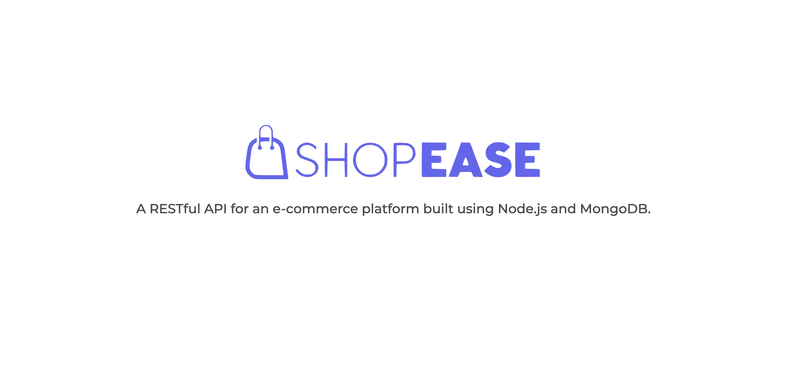

# Shopease API

## 0. Table of Contents

1. [Overview](#1-overview)
2. [API Documentation](#2-api-documentation)
3. [Main Features](#3-main-features)
4. [Schemas and Routes](#4-schemas-and-routes)
   - [Authentication Routes](#authentication-routes)
   - [User Routes](#user-routes)
   - [Address Routes](#address-routes)
   - [Cart Routes](#cart-routes)
   - [Wishlist Routes](#wishlist-routes)
   - [Product Routes](#product-routes)
   - [Category Routes](#category-routes)
   - [Brand Routes](#brand-routes)
   - [Coupon Routes](#coupon-routes)
   - [Order Routes](#order-routes)
   - [Review Routes](#review-routes)

## 1. Overview

A RESTful API for an ecommerce platform to manage authentication, users, cart, wishlist, addresses, products, categories, brands, coupons, orders and reviews. It is built with Express.js and uses MongoDB as a database.

## 2. API Documentation

Swagger is used for API documentation. To view API docs, [click here](http://api.shopease.shubhampurwar.in/docs/swagger).

## 3. Main Features

- User authentication via JSON Web Tokens
- Database modelling using various Mongoose schemas
- Centralized error handling using Express middlewares
- Validation of request payload using Joi
- Routing using Express middlewares
- Logging of HTTP requests using Morgan
- Ability to parse multipart/form-data using Formidable
- Upload and delete images using Cloudinary APIs
- Ability to send emails using Nodemailer
- Integration of Razorpay payment gateway
- Verification of email addresses and phone numbers using Abstract APIs (third party service)
- Scheduled Cron jobs to check the expiry status of coupons
- Configured PM2 to keep API and Cron jobs running as daemon processes to ensure availability
- API and Cron jobs are deployed on DigitalOcean droplet using Nginx as a web server
- Swagger for documentation of APIs

## 4. Schemas and Routes

Shopease API consists of 8 schemas and 70+ routes and controllers.

### Authentication Routes

| Action          | Method | Route                       |
| :-------------- | :----- | :-------------------------- |
| Signup          | POST   | /auth/signup                |
| Login           | POST   | /auth/login                 |
| Logout          | POST   | /auth/logout                |
| Forgot password | POST   | /auth/password/forgot       |
| Reset password  | PUT    | /auth/password/reset/:token |

### User Routes

| Action               | Method | Route                     |
| :------------------- | :----- | :------------------------ |
| Fetch profile        | GET    | /users/self               |
| Update profile       | PUT    | /users/self               |
| Delete account       | DELETE | /users/self               |
| Add profile photo    | POST   | /users/self/avatar        |
| Remove profile photo | PUT    | /users/self/avatar        |
| Update profile photo | POST   | /users/self/avatar/update |
| Fetch users          | GET    | /admin/users              |
| Fetch user by ID     | GET    | /admin/users/:userId      |
| Update user role     | PUT    | /admin/users/:userId      |
| Delete user          | DELETE | /admin/users/:userId      |
| Fetch other admins   | GET    | /admin/admins             |
| Admin self demote    | PUT    | /admin/self               |
| Admin self delete    | DELETE | /admin/self               |

### Address Routes

| Action              | Method | Route                         |
| :------------------ | :----- | :---------------------------- |
| Fetch addresses     | GET    | /addresses                    |
| Add new address     | POST   | /addresses                    |
| Fetch address by ID | GET    | /addresses/:addressId         |
| Update address      | PUT    | /addresses/:addressId         |
| Delete address      | DELETE | /addresses/:addressId         |
| Set default address | PUT    | /addresses/:addressId/default |

### Cart Routes

| Action                | Method | Route        |
| :-------------------- | :----- | :----------- |
| Fetch cart            | GET    | /cart        |
| Add item to cart      | POST   | /cart/add    |
| Remove item from cart | PUT    | /cart/remove |
| Update item quantity  | PUT    | /cart/update |
| Move item to wishlist | PUT    | /cart/move   |
| Clear cart            | PUT    | /cart/clear  |

### Wishlist Routes

| Action                    | Method | Route            |
| :------------------------ | :----- | :--------------- |
| Fetch wishlist            | GET    | /wishlist        |
| Add item to wishlist      | PUT    | /wishlist/add    |
| Remove item from wishlist | PUT    | /wishlist/remove |
| Move item to cart         | PUT    | /wishlist/move   |
| Clear wishlist            | PUT    | /wishlist/clear  |

### Product Routes

| Action                    | Method | Route                              |
| :------------------------ | :----- | :--------------------------------- |
| Fetch products            | GET    | /products                          |
| Fetch product by ID       | GET    | /products/:productId               |
| Admin fetch products      | GET    | /admin/products                    |
| Add new product           | POST   | /admin/products                    |
| Admin fetch product by ID | GET    | /admin/products/:productId         |
| Update product details    | POST   | /admin/products/:productId         |
| Delete product            | DELETE | /admin/products/:productId         |
| Restore deleted product   | PUT    | /admin/products/:productId/restore |

### Category Routes

| Action                  | Method | Route                         |
| :---------------------- | :----- | :---------------------------- |
| Fetch all categories    | GET    | /categories                   |
| Fetch category by ID    | GET    | /categories/:categoryId       |
| Add new category        | POST   | /admin/categories             |
| Update category         | POST   | /admin/categories/:categoryId |
| Fetch listed categories | GET    | /categories/listed            |

### Brand Routes

| Action              | Method | Route                  |
| :------------------ | :----- | :--------------------- |
| Fetch all brands    | GET    | /brands                |
| Fetch brand by ID   | GET    | /brands/:brandId       |
| Add new brand       | POST   | /admin/brands          |
| Update brand        | POST   | /admin/brands/:brandId |
| Fetch listed brands | GET    | /brands/listed         |

### Coupon Routes

| Action                | Method | Route                               |
| :-------------------- | :----- | :---------------------------------- |
| Fetch valid coupons   | GET    | /coupons                            |
| Check coupon validity | GET    | /coupons/validity                   |
| Admin fetch coupons   | GET    | /admin/coupons                      |
| Create new coupon     | POST   | /admin/coupons                      |
| Fetch coupon by ID    | GET    | /admin/coupons/:couponId            |
| Update coupon details | PUT    | /admin/coupons/:couponId            |
| Delete coupon         | DELETE | /admin/coupons/:couponId            |
| Activate coupon       | PUT    | /admin/coupons/:couponId/activate   |
| Deactivate coupon     | PUT    | /admin/coupons/:couponId/deactivate |

### Order Routes

| Action                  | Method | Route                    |
| :---------------------- | :----- | :----------------------- |
| Fetch orders            | GET    | /orders                  |
| Create new order        | POST   | /orders                  |
| Fetch order by ID       | GET    | /orders/:orderId         |
| Confirm order           | PUT    | /orders/:orderId/confirm |
| Cancel order            | PUT    | /orders/:orderId/cancel  |
| Admin fetch orders      | GET    | /admin/orders            |
| Admin fetch order by ID | GET    | /admin/orders/:orderId   |
| Update order status     | PUT    | /admin/orders/:orderId   |
| Delete order            | DELETE | /admin/orders/:orderId   |

### Review Routes

| Action                | Method | Route                        |
| :-------------------- | :----- | :--------------------------- |
| Fetch product reviews | GET    | /products/:productId/reviews |
| Add product review    | POST   | /products/:productId/reviews |
| Fetch review by ID    | GET    | /reviews/:reviewId           |
| Update product review | PUT    | /reviews/:reviewId           |
